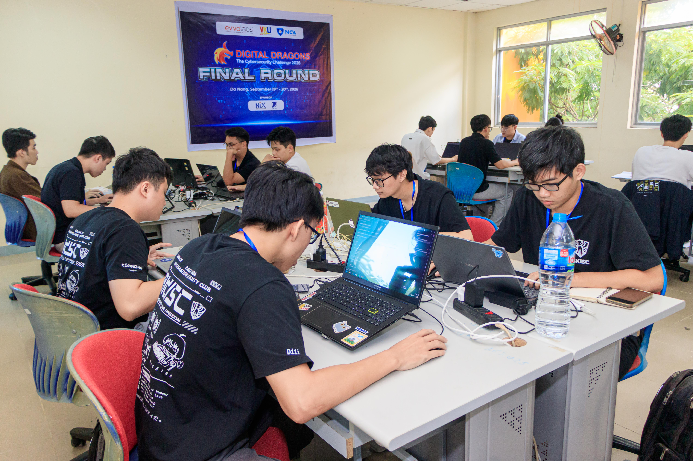
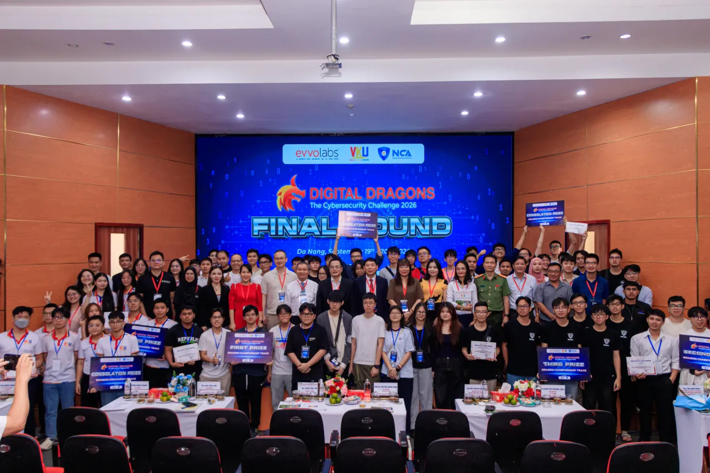
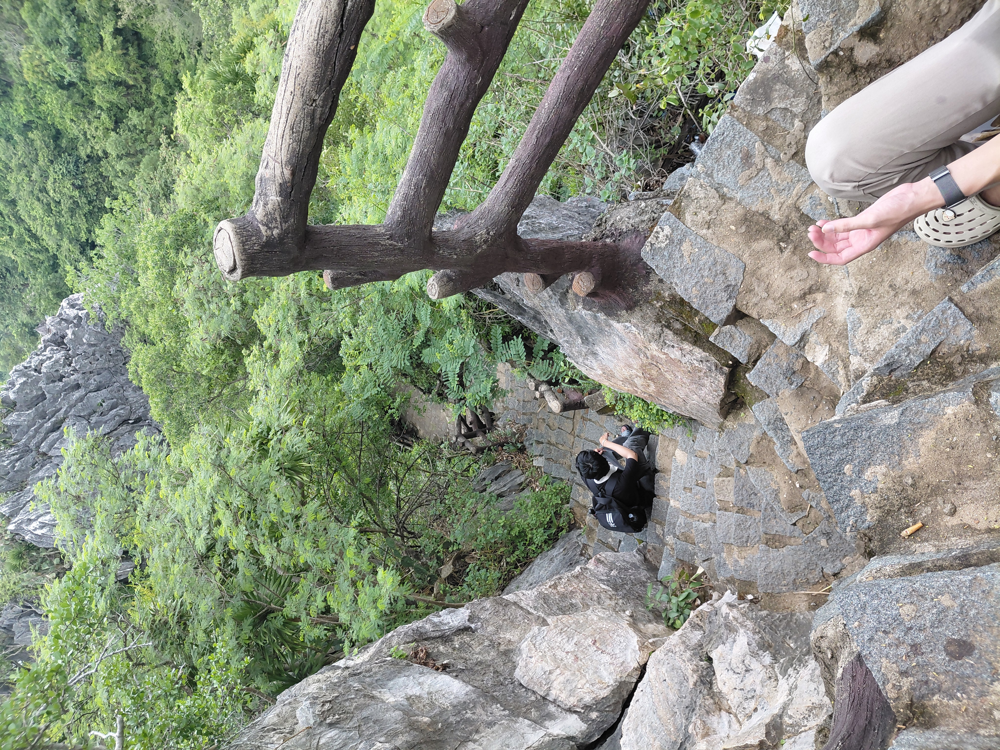
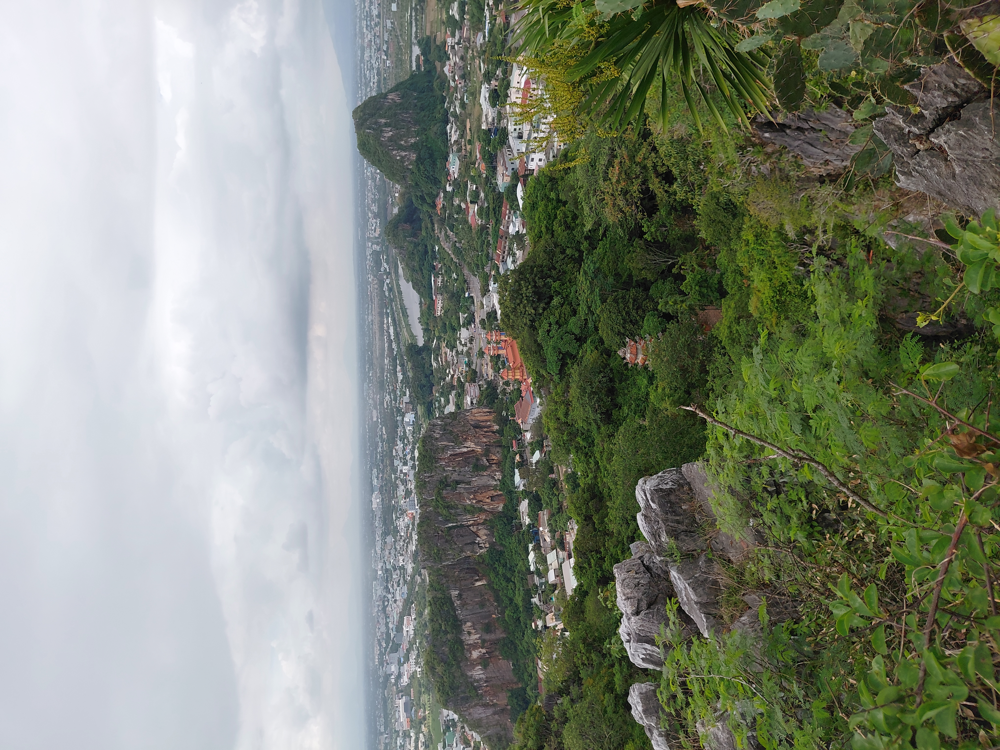
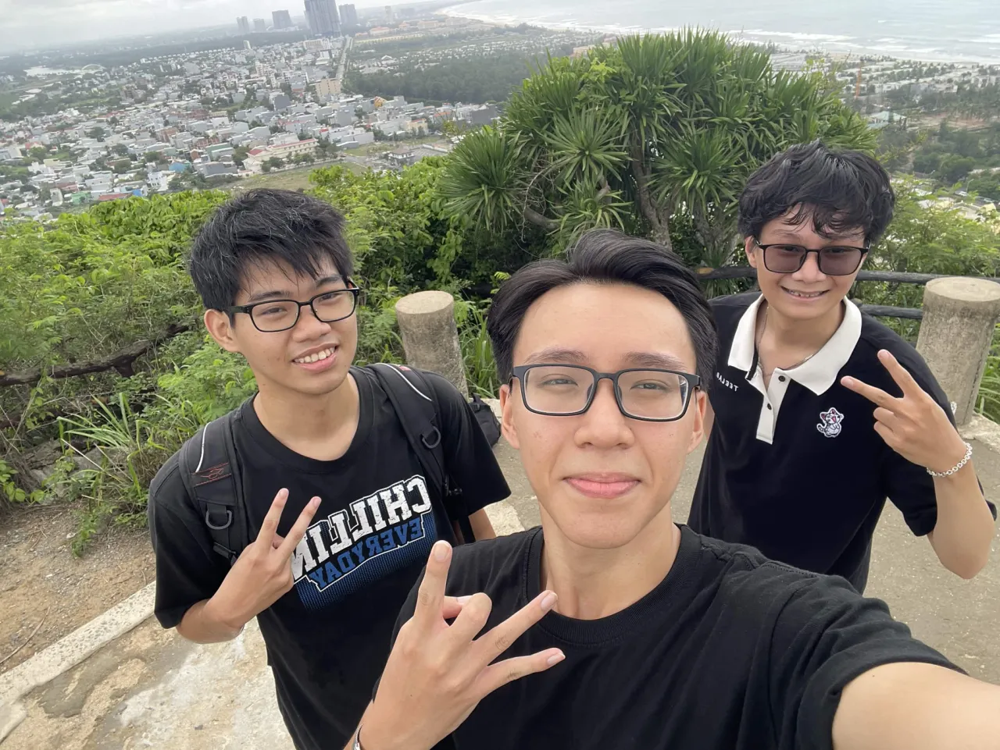
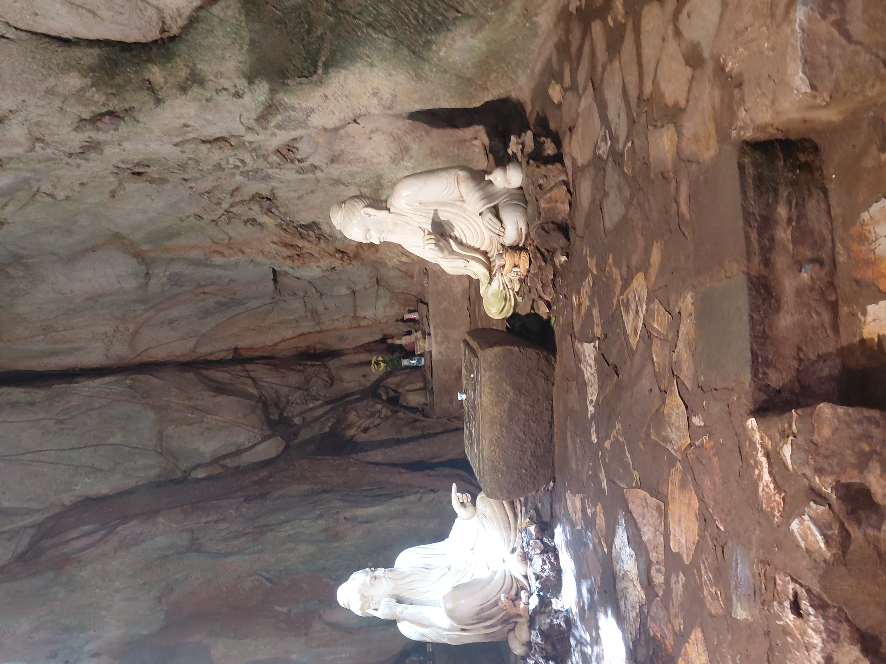
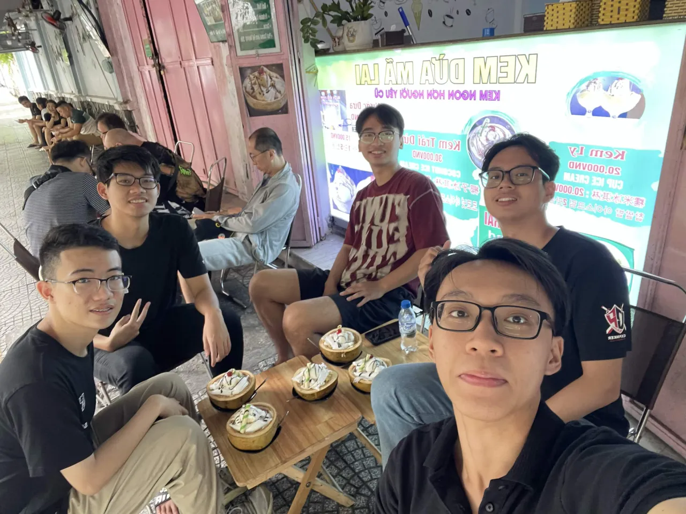
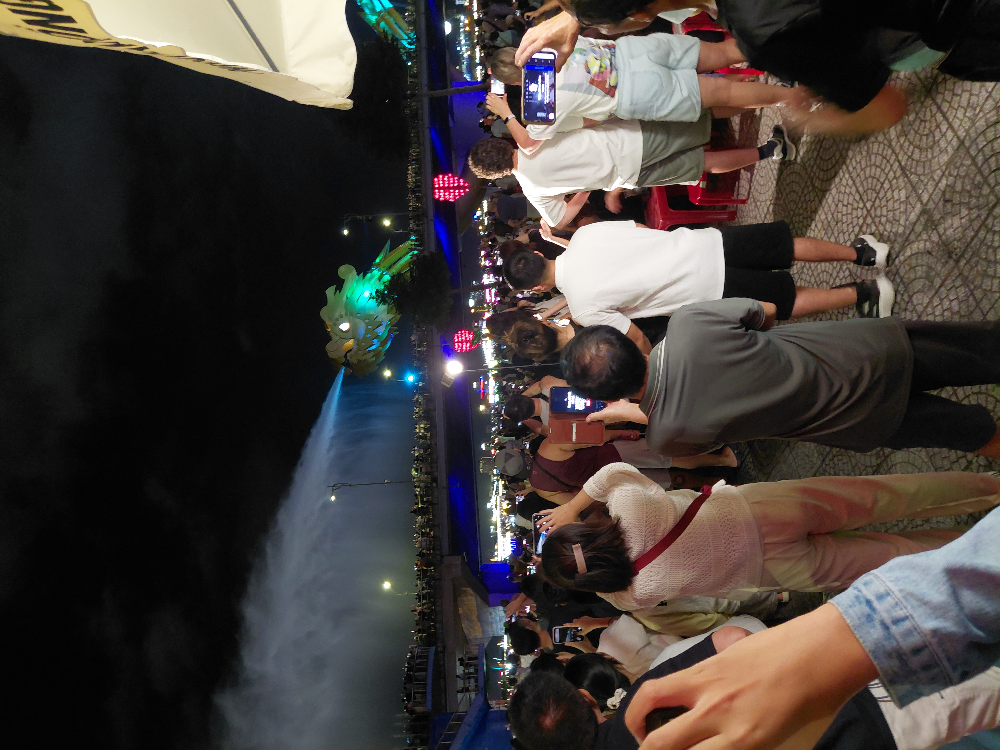

Da Nang was the destination for my first onsite CTF competition. Although I didn't finish as high in the rankings as I'd hoped, the trip still left me with some great memories and a chance to explore the city with friends.

## My first onsite CTF

A few memories from the competition, from working through challenges together to the group photo at the awards ceremony. And another win for BKISC!

## Exploring Da Nang

Away from the competition, there was time for sightseeing: stone steps winding through the rocks, views across the city, and a stop inside a cave.

## Time with friends

There were also moments to enjoy the city together, from coconut ice cream to watching the dragon spray water over the bridge at night.

