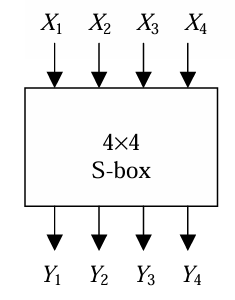

Recently, I learned this technique called Linear Cryptanalysis, so I write this to share about how I make sense of this technique. I will using a **basic Substitution-Permutation Network (SPN)** as the target cipher that we want to break and present the ideas of the technique on that cipher.

## Table of contents

## 1. Introduction
- Linear cryptanalysis was introduced by **Matsui** at **EUROCRYPT ’93** as atheoretical attack on the Data Encryption Standard (DES) and later successfully used in the practical cryptanalysis of DES.
- This is one of two major **statistical techniques** and design criteria for block cipher.
- Main idea: we recover the key by established an equation that acts as an random detector or distinguisher to get the key. That equation contains plaintext and ciphertext xoring together.
## 2. Approximating non-linear function with linear function.
we could try to approximating a non-linear function with a function that only have the operator $\oplus$. For example, an **And gate** can be approximate as some linear function.

<div align="center" style="font-size: 1em;">

| x | y | | x $\wedge$ y | 0 | x | y | x $\oplus$ y |
| :---: | :---: | :---: | :---: | :---: | :---: | :---: | :---: |
| 0 | 0 | | 0 | 0 | 0 | 0 | 0 |
| 0 | 1 | | 0 | 0 | 0 | 1 | 1 |
| 1 | 0 | | 0 | 0 | 1 | 0 | 1 |
| 1 | 1 | | 1 | 0 | 1 | 1 | 0 |
</div>

- We see that in this table the best approximation of the and gate is $0$, x and y with the probability of $3/4$ matched cases. So if we assumed the and gate is those value we will be right most of the cases.
- Beside, these linear function we could also take **Affine function**, which is linear plus a constant. In this case, we could have $1 , x\oplus 1, y \oplus 1, x\oplus y \oplus 1$ as approximations.
- We note that if a linear function considered as a *bad* approximation, that less than $1/2$ then we always can take it affine function, and get a *good* approximation. Example: $x \oplus y \oplus 1 $ and $x \oplus y$ in the above table.
## 3. S-boxes
In our cipher we will use this S-box to perform substitution on a 4-bits value.

| input  | 0 | 1 | 2 | 3 | 4 | 5 | 6 | 7 | 8 | 9 | A | B | C | D | E | F |
| :---   |:-:|:-:|:-:|:-:|:-:|:-:|:-:|:-:|:-:|:-:|:-:|:-:|:-:|:-:|:-:|:-:|
| output | E | 4 | D | 1 | 2 | F | B | 8 | 3 | A | 6 | C | 5 | 9 | 0 | 7 |

In our linear cryptanalysis, we wants to get a relation between some **bits** of the input and some of the output xor together
<div align="center">



</div>

For example consider, 
$X_2 \oplus X_3 \oplus Y_1 \oplus Y_3 \oplus Y_4 = 0$ or it equivalent equation 
$$ 
X_2 \oplus X_3 = Y_1 \oplus Y_3 \oplus Y_4 
$$ 

Applying all 16 possible input values for X and examining the corresponding output 
values Y, it may be observed that for exactly 12 out the 16 cases, the expression above holds true. Hence the probability is $12/16$.

$$
\begin{array}{|cccc||cccc||cc|}
\hline
X_1 & X_2 & X_3 & X_4 & Y_1 & Y_2 & Y_3 & Y_4 & X_2 \oplus X_3 & Y_1 \oplus Y_3 \oplus Y_4 \\
\hline \hline
0 & 0 & 0 & 0 & 1 & 1 & 1 & 0 & 0 & 0 \\
0 & 0 & 0 & 1 & 0 & 1 & 0 & 0 & 0 & 0 \\
0 & 0 & 1 & 0 & 1 & 1 & 0 & 1 & 1 & 0 \\
0 & 0 & 1 & 1 & 0 & 0 & 0 & 1 & 1 & 1 \\
0 & 1 & 0 & 0 & 0 & 0 & 1 & 0 & 1 & 1 \\
0 & 1 & 0 & 1 & 1 & 1 & 1 & 1 & 1 & 1 \\
0 & 1 & 1 & 0 & 1 & 0 & 1 & 1 & 0 & 1 \\
0 & 1 & 1 & 1 & 1 & 0 & 0 & 0 & 0 & 1 \\
1 & 0 & 0 & 0 & 0 & 0 & 1 & 1 & 0 & 0 \\
1 & 0 & 0 & 1 & 1 & 0 & 1 & 0 & 0 & 0 \\
1 & 0 & 1 & 0 & 0 & 1 & 1 & 0 & 1 & 1 \\
1 & 0 & 1 & 1 & 1 & 1 & 0 & 0 & 1 & 1 \\
1 & 1 & 0 & 0 & 0 & 1 & 0 & 1 & 1 & 1 \\
1 & 1 & 0 & 1 & 1 & 0 & 0 & 1 & 1 & 0 \\
1 & 1 & 1 & 0 & 0 & 0 & 0 & 0 & 0 & 0 \\
1 & 1 & 1 & 1 & 0 & 1 & 1 & 1 & 0 & 0 \\
\hline
\end{array}
$$

We then could select a mask that denoted our selected that we are going to use in the approximate equation.

**Linear Mask**
We are interested in any linear equation of the $b$ input and $b$ output bits. We select these bits using masks $\alpha, \beta \in \mathbb{F}_2^b$ and the inner product:$$\alpha \cdot x := \bigoplus \alpha_i \cdot x_i$$
In the previous example, $\alpha = 0110$ and $\beta = 1011$, and the linear approximation can be express as
$$
\alpha \cdot x = \beta \cdot S(x)
$$

## 4. Measuring the quality of the approximation: Bias & cor.
The quality of an approximation $(\alpha, \beta)$ for a $b$-bit S-box $\mathcal{S}$ can be described using the following metrics:
- Solutions ($s$): The number of times the linear equation holds true.
$$
s = |\{x \in \mathbb{F}_2^b \mid \alpha \cdot x = \beta \cdot \mathcal{S}(x)\}|$$
- Probability ($p$): The likelihood that the approximation holds over all possible inputs.
$$p = \mathbb{P}_x[\alpha \cdot x = \beta \cdot \mathcal{S}(x)] = s/2^b$$

- Bias ($\epsilon$): How far the probability deviates from a perfectly random $1/2$.
$$\epsilon = p - \frac{1}{2}$$
- Correlation ($cor$): A normalized measure of the bias.
$$cor = 2 \cdot \epsilon$$
> The farther the probability from $1/2$ the better the approximation distinct from random.

Assume we have a linear approximation $ \alpha \cdot x = \beta \cdot S(x)$ then 
- if $\epsilon = 0$ we learn nothing, it as good as random guess.
- if $\epsilon > 0$ the approximation $\alpha \cdot x = \beta \cdot S(x)$ is good
- if $\epsilon < 0 $ the approximation $\alpha \cdot x = \beta \cdot S(x) \oplus 1 $ is good

## 5. Linear Approximation Table (LAT)
To show how good each of the approximation are we use the **Linear approximation table**, whose elements indicated by $LAT[\alpha][\beta] = 2^b\epsilon_{\alpha, \beta} = 2^b(\dfrac{n_{correct}}{2^b} - \dfrac{1}{2}) = n_{correct} - 2^{b-1}$. For example in our previous S-box 
$$LAT[6][11]  = 2^4 . \left(\dfrac{12}{16} - \dfrac{1}{2}\right) = 4$$

In **sage math** there is a method that could help you calculate all the value in that table.
```python
sage: from sage.crypto.sbox import SBox
sage: S = SBox(0xE, 0x4, 0xD, 0x1, 0x2, 0xF, 0xB, 0x8, 0x3, 0xA, 0x6, 0xC, 0x5, 0x9, 0x0, 0x7, big_endian=False)
sage: lat = S.linear_approximation_table()
sage: lat
[ 8  0  0  0  0  0  0  0  0  0  0  0  0  0  0  0]
[ 0  0 -2 -2  0  0 -2  6  2  2  0  0  2  2  0  0]
[ 0  0 -2 -2  0  0 -2 -2  0  0  2  2  0  0 -6  2]
[ 0  0  0  0  0  0  0  0  2 -6 -2 -2  2  2 -2 -2]
[ 0  2  0 -2 -2 -4 -2  0  0 -2  0  2  2 -4  2  0]
[ 0 -2 -2  0 -2  0  4  2 -2  0 -4  2  0 -2 -2  0]
[ 0  2 -2  4  2  0  0  2  0 -2  2  4 -2  0  0 -2]
[ 0 -2  0  2  2 -4  2  0 -2  0  2  0  4  2  0  2]
[ 0  0  0  0  0  0  0  0 -2  2  2 -2  2 -2 -2 -6]
[ 0  0 -2 -2  0  0 -2 -2 -4  0 -2  2  0  4  2 -2]
[ 0  4 -2  2 -4  0  2 -2  2  2  0  0  2  2  0  0]
[ 0  4  0 -4  4  0  4  0  0  0  0  0  0  0  0  0]
[ 0 -2  4 -2 -2  0  2  0  2  0  2  4  0  2  0 -2]
[ 0  2  2  0 -2  4  0  2 -4 -2  2  0  2  0  0  2]
[ 0  2  2  0 -2 -4  0  2 -2  0  0 -2 -4  2 -2  0]
[ 0 -2 -4 -2 -2  0  2  0  0 -2  4 -2 -2  0  2  0]
sage: lat[6][11]
4
```
The larger the absolute value of each element tell we more information while the 0 is useless.

## 6. Linear approximation of Affine (Linear) function
When considering a purely linear function (such as a diffusion layer)
 $$
 y = \mathcal{L}(x)
 $$, 
 Then any approximation is either perfect ($cor = \pm 1$) or useless ($cor = 0$). 
 - Write $ \mathcal{L}(x)$ as a matrix multiplication $L.x$ then we have
 $$
 \alpha \cdot x = \beta \cdot \mathcal{L}(x) = \beta (L \cdot x) = (L^T \cdot \beta) \cdot x
 
 $$

 $$
cor_{\mathcal{L}}(\alpha, \beta) =
\begin{cases}
1 & \text{if } \alpha = L^T \cdot \beta, \\
0 & \text{else } 
\end{cases}
 $$
 - If  $\mathcal{L}(x)$ is a Affine function then the result can also take value $-1$.
## 7. Key addition 
In our previous examples, we takes the input as the initial value, but in the real cipher before go through the S-box it first xored with the keys. Therefore, we must add the **corresponding key-bits** that added to the plaintext or initial input. So the we can get the key from [previous example](#3-s-boxes).
$U_2 \oplus U_3 = Y_1 \oplus Y_3 \oplus Y_4$
$$ 
\Rightarrow K_2 \oplus X_2 \oplus K_3 \oplus X_3 = Y_1 \oplus Y_3 \oplus Y_4 \\
\Rightarrow K_2 \oplus K_3 =  X_2 \oplus X_3 \oplus Y_1 \oplus Y_2 \oplus Y_3 
$$ 
If we know the plaintext and ciphertext then this equation reviews some information about key-bits.

### Combining Linear Approximations
Imagine we have **two consecutive rounds**. We find a linear approximation for each:

Round 1 (Input $x$ $\to$ Output $y$):We approximate the first round using input mask $\alpha$ and output mask $\beta$.$$\alpha \cdot x \oplus \kappa \cdot k = \beta \cdot y$$

We approximate the second round using the same mask $\beta$ for the input that we used for the previous output.$$\beta \cdot y \oplus \kappa' \cdot k' = \gamma \cdot z$$
In Round 1, $\beta \cdot y$ is the result.In Round 2, $\beta \cdot y$ is the input.If we XOR these two equations together, the intermediate term $\beta \cdot y$ cancels out.

By eliminating the intermediate variable $y$, we get a direct linear relationship between the initial input $x$, the final output $z$, and the **combined key bits**.$$\alpha \cdot x \oplus \kappa \cdot k \oplus \kappa' \cdot k' = \gamma \cdot z$$
This ensure that if we use the previous output as the next input for each rounds we could construct the equation only knowing the plaintext and the ciphertext.

## 8. The Bias of combining Linear Approximations.
Let takes a look at two consecutive rounds case, the approximation is correct if the previous two are both correct or both wrong. If we assumed that they're independent then the probability is.
$$
\begin{aligned}
p &= p_1 \cdot p_2 + (1 - p_1) \cdot (1 - p_2) \\
  &= 2 \cdot p_1 \cdot p_2 - p_1 - p_2 + 1 \\
  &= 2 \cdot \left(\frac{1}{2} + \varepsilon_1\right) \cdot \left(\frac{1}{2} + \varepsilon_2\right) - \left(\frac{1}{2} + \varepsilon_1\right) - \left(\frac{1}{2} + \varepsilon_2\right) + 1 \\[10pt]
  &= \frac{1}{2} + 2 \cdot \varepsilon_1 \cdot \varepsilon_2 \\ 
\end{aligned}
$$
Then the combined bias is $ \varepsilon =  2 \cdot \varepsilon_1 \cdot \varepsilon_2$. In general form, this is known as the **Piling-Up lemma**.

>**Theorem (Piling-up Lemma)**
Let $X_i$ $(1 \le i \le n)$ be independent Boolean expressions (corresponding to the individual approximations) with probabilities $p_i = \mathbb{P}(X_i = 0) = \frac{1}{2} + \varepsilon_i$. Then
>$$
\mathbb{P}(X_1 \oplus X_2 \oplus \dots \oplus X_n = 0) = \frac{1}{2} + 2^{n-1} \prod_{i=1, \dots, n} \varepsilon_i
$$
Or in terms of the correlation $\text{cor} = 2\varepsilon$:
$$
\text{cor} = \prod_{i=1, \dots, n} \text{cor}_i.
$$
