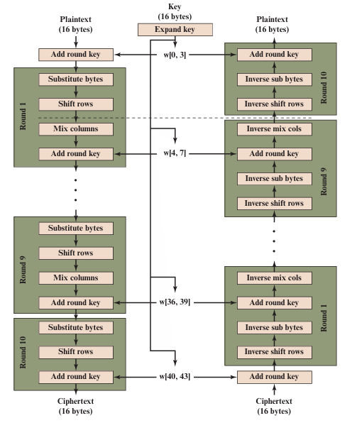

## Table of contents

## 1. Introduction to Finite Field
- **Fields** are a subset of a larger class of algebraic structures called **rings**, which are a subset of the larger class of **groups**. Each successive subset adds additonal properties and is thus more complex.

- **Finite Fields** are a subset of fields, consisting of those field that have finite element. These class of fields that are found in cryptography algorithms.

- A more importent class of finite fields, for cryptography, compries those with $2^n$, denoted $GF(2^n)$. Which are used a wide variety of cryptographic algorithms.


### Groups
In abstract algebra, we are concerned with sets on whose elements we can operate algebraically, that is, we can combine two element of the set, perhaps in several ways, to obtain a third element of the set. 

#### Definiton 

> A group G, sometimes denoted by $\{G, \cdot \}$, is a set of element with a binary operation denoted by $ \cdot $ that associates to each ordered pair $(a,b)$ of element in G an element $(a \cdot b)$ in $G \times G$, such that the following axioms are obeyed.

$$
\begin{aligned}
&\textbf{(A1) Closure:} & \quad \text{if } a, b \in G, \text{ then } a \cdot b \in G \\

&\textbf{(A2) Associative:} & \quad a \cdot (b \cdot c) = (a \cdot b) \cdot c, \quad \forall a, b, c \in G \\

&\textbf{(A3) Identity element:} & \quad \exist e \in G \text{ such that } a \cdot e = e \cdot a = a,  \forall a \in G \\

&\textbf{(A4) inverse element:} & \quad \exist a' \in G \text{ such that } a \cdot a' = a' \cdot a = e, \forall a \in G.
\end{aligned}
$$


#### Abelian Group
A group is said to be abelian if it satisfies the following additional condition:
$$
\textbf{(A5) Commutative} \quad  a \cdot b = b \cdot a , \forall a,b \in G
$$

#### Cyclic Group 
we define $a^n = a \cdot a \cdot ... \cdot a$, n times, futhermore, $a^0 = e$ and $a^{-n} = (a')^n$, where a' is the inverse element of a within the group. A group $G$ is cyclic if every element of G is a power of a, of fixed element $a \in G$. The element a is said to generate the group G. A cyclic group is always abelian and may be finite or infinite.

### Rings
>A ring $R$, sometimes denoted by $\{R, +, \times\}$, is a set of element with two binary operations, called addition and multiplicaton, such that the following axioms are obeyed.

$$
\begin{aligned}
&\textbf{(A1-A5)} \quad R \, \, \text{is an abelian group with respect to additon, that is satisfy A1 through A5} \\

&\textbf{(M1) closure under multiplication} \quad \text{same with the definiton in group.} \\

&\textbf{(M2) Associativity of multiplication}
\quad a(bc) = (ab)c, \forall a,b,c \in R. \\

&\textbf{(M3) Distributive laws:} \quad
a(b + c) = ab + ac,\quad \forall a,b,c \in R, 
\quad (a+b)c = ac + bc, \quad \forall a,b,c \in R.

\end{aligned}
$$

> In essence, a ring is a set of element in which we can do addition, subraction, and multiplication without leaving the set.

A ring is said to be commutative if it satisfies the following additional condition.
$$
\textbf{(M4) Commutativity of multiplication: } ab = ba, \forall a,b \in R.
$$

A intergral domain is a commutative ring that oveys the following axioms.

$$
\begin{aligned}
&\textbf{(M5) multiplicative identity} \quad \text{There is an element } 1 \in R \text{ such that } a1 = 1a = a, \quad \forall a \in R. \\

&\textbf{(M6) No zero divisors} \text{ If } ab = 0  \text{ then either } a = 0 \text{ or } b = 0. \\
\end{aligned}
$$ 


### Fields
A field $F$, sometimes denoted by $\{F, +, \times\}$, is a set of elements with two binary operations, called additon and multiplication, such that following axioms are obeyed.

$$
\begin{array}{l l} 
  \textbf{(A1-M6)} & F \text{ is an integral domain; that is, it}  \\
                   & \text{satisfies axioms A1 through A5 and } \\ 
                   & \text{ M1 through M6.}
                   \\[1.5em]
                   
  \textbf{(M7) Inverse} & \text{For each } a \in F \text{ (except 0), there } \\
                        & \text{ is an element }   a^{-1} \in F \text{ such that } a a^{-1} = a^{-1}a = 1.
\end{array}
$$

## 2. Polynomial Arithmetic with Coefficents in $\Z_p$
Given polynomials $f(x)$ of degree n and $g(x)$ of degree $(m)$, $(n \leq m)$, if we divide $f(x)$ by $g(x)$, we get a quotient $q(x)$ and a remainder $r(x)$ that obey the relationship.
$$ f(x) = q(x)g(x) + r(x) $$

with polynomial degrees:
    - $deg(f(x)) = n$
    - $deg(g(x)) = m$
    - $deg(q(x)) = n - m $
    - $ 0 \leq deg(r(x)) \leq m-1$

A polynomial $f(x)$ over a field $F$ is called irreducible if and only if $f(x)$ cannot be expressed as a product of two polynomials, both over $F$, and both of degree greater than - and lower than that of $f(x)$.

Example:
>The polynomial $f(x) = x^4 + 1$ over $GF(2)$ is reducible, because $x^4 + 1 = (x+1)(x^3 + x^2 + x + 1)$

### Finding the Greatest Common Divisor
The polynomial $c(x)$ is said to be the greatest common divisor of $a(x)$ and $b(x)$ if the following are true.
1. c(x) divides both $a(x)$ and $b(x)$.
2. Any divisor of $a(x)$ and $b(x)$ is a divisor of $c(x)$.

An equivanlent definition is gcd(a(x),b(x)) is the polynomial of maximum degree that divides both a(x) and b(x)

We can adapt the Euclidean algorithm to compute the greatest common divisor of two polynomials. 
$$ gcd(a(x), b(x)) = gcd(b(x), a(x) mod b(x)) $$


## 3. Finite Fields of The Form $GF(2^n)$
Suppose we wish to define a conventional encryption algorithm that operates on data 8 bits at a time, and we wish to perform division. With 8 bits, we can represent integers in the range 0 through 255. However, 256 is not a prime number, so that if arithmetic is performed in $\Z_{256}$ (arithmetic modulo 256), this set of integers will not be a field. The closest prime number less than 256 is 251. Thus, the set $\Z_{251}$, using arithmetic modulo 251, is a field. Howeve6r, in this case the 8-bit patterns representing the integers 251 through 255 would not be used, resulting in inefficient use of storage.

```python
sage: F.<x> = GF(2^8, modulus = x^8 + x^4 + x^3 + x + 1)
sage: f = F.from_integer(234)
sage: f
x^7 + x^6 + x^5 + x^3 + x
sage: f.to_integer()
234
```

### Modular Polynomial Arithmetic
Consider the set S of all polynomials of degree n - 1 or less over the field $\Z_p$. Thus, each polynomial has the form.
$$
f(x) = a_{n-1}x^{n-1} + a_{n-2}x^{n-2} + \dots + a_1x + a_0 = \sum_{i=0}^{n-1} a_ix^i
$$
For $GF(p^n)$ there are $p^n$ different polynomials in S, where each $a_i$ takes on a value in the set $\{0,1,...,p-1\}$.

Every polynomials mad a residue class $[\, p(x) \,] \, \pmod{m(x)}$. Constisting every polynomial $a(x) \equiv p(x) \pmod{m(x)} $

The Arithmetic rule are the same with polynomial arithmetic, but with coefficents is performed modulo p. And if a multiplication result in a polynomial of degree greater than n-1 then the polynomial is reduced modulo some irreducible polynomial m(x) of degree n. 

The **Advanced Encryption Standard (AES)** uses arithmetic in the finite field $GF(2^8)$, with the irreducible polynomial $m(x) = x^8 + x^4 + x^3 + x + 1$.

Sage example:
```python
sage: F.<x> = GF(2^8, name = 'x', modulus = x^8 + x^4 + x^3 + x + 1)
sage: f = x^6 + x^4 +  x^2 + x + 1
sage: g = x^7 + x + 1
sage: f + g
x^7 + x^6 + x^4 + x^2
sage: f - g
x^7 + x^6 + x^4 + x^2
sage: f * g
x^7 + x^6 + 1
sage: f/g
x^5 + x^4 + x^3
```


### Finding the Multiplicative Inverse
Just as the Euclidean algorithm can be adapated to find the greatest common divisor of two polynomials, the extended Euclidean algorithm can be adapted to find the multiplicative inverse of a polynomial.

*Example*: Find the inverse of $f(x) = x^6 + x^4 + x^2 + x + 1$ on $GF(2^8) \text{ with the irreducible polynomial } m(x) = x^8 + x^4 + x^3 + x + 1$

We will use the extended euclidean algorithm on polynomial ring of GF(2) to find the solution of 
$$
f(x) . X(x) + m(x) . Y(x) = 1
$$ 
| r(x) | X(x) | Y(x) | q(x) |
| :--- | :---: | :---: |  :---- |
|  $m(x) =  x^8 + x^4 + x^3 + x + 1$ | 0 | 1 | |
| $f(x) = x^6 + x^4 + x^2 +x + 1$| 1 | 0 | $x^2 + 1$  |
|$x^4$ | $x^2 + 1$ | 1 | $x^2 + 1$|
|$x^2 + x + 1$ |$x^4$|$x^2 + 1$|$x^2 + x$|
|$x$| $x^6 + x^5 + x^2 + 1$ | $x^4 + x^3 + x^2 + x + 1$ | $x+1$ |
|1 | $x^7 + x^5 + x^4 + x^3 + x^2 + x + 1$ |

*Sage code example*
```python
sage: F.<x> = PolynomialRing(GF(2)) #define polynomial ring
sage: f = x^6 + x^4 +  x^2 + x + 1
sage: m = x^8 + x^4 + x^3 + x + 1

sage: G.<y> = GF(2^8, modulus = x^8 + x^4 + x^3 + x + 1) #define Galois field 
sage: xgcd(f,m)
(1, x^7 + x^5 + x^4 + x^3 + x^2 + x + 1, x^5 + x^2)
#extended euclide algorithm [0] = a.[1] + b.[2]
sage: g = f.subs(x = y)
sage: g
y^6 + y^4 + y^2 + y + 1
sage: g^-1
y^7 + y^5 + y^4 + y^3 + y^2 + y + 1

# we see that g^-1 and xgcd(f,m)[1] are the same
```

### Multiplication in $GF(2^8)$
We can show that $x^8 \equiv m(x) - x^8 \pmod{m(x)}$, in fact this is true for all power $x^n$.
So let the AES irreducible $m(x) = x^8 + x^4 + x^3 + x + 1$, then $x^8 = x^4 + x^3 + x + 1$. This result can be used to quickly calculate the **multiple of a giving 8-bits integer with 2**.

Let assume we have the integer $f = b_7 b_6 b_5 b_4 b_3 b_2 b_1 b_0$ and we want to calculate $2f$, since it just equivalent to multiply $x$ with the polynomial  $f(x) = b_7x^7 + b_6x^6 + b_5x^5 + b_4x^4 + b_3x^3 + b_2x^2 + b_1x +b_0$ we have 
$$
xf(x) = b_7x^8 + b_6x^7 + b_5x^6 + b_4x^5 + b_3x^4 + b_2x^3 + b_1x^2 +b_0x
$$
if $b_7 = 0$ then we get the result

if $b_7 = 1$ then 
$$
xf(x) = b_6x^7 + b_5x^6 + b_4x^5 + b_3x^4 + b_2x^3 + b_1x^2 +b_0x + (x^4 + x^3 + x + 1)
$$
So we have the algorithm
$$ 
xf(x) = 
\begin{cases}
b_6 b_5 b_4 b_3 b_2 b_1 b_00 & \text{if } b_7 = 0 \\
b_6 b_5 b_4 b_3 b_2 b_1 b_00 \, \oplus 000011011  & \text{if } b_7 = 1
\end{cases}
$$
**Multiple two 8-bits value in $GF(2^8)$**

If we want to calculate $f(x)g(x)$, if the polynomial of $g(x)$ not have the free coefficient then $f(x)g(x) = xf(x)g'(x)$ with $g'(x)$ is a polynomial represent the right-shift of g(x). If $g(x)$ has the free coeffiecient $1$ then $f(x)g(x) = f(x) + f(x)g''(x)$ with $g''(x)$ is the polynomial with zero free coefficient.

So we get the algorithm
```
Algorithm: Multiplication(8-bits f, 8-bits g)
Out: f*g in GF(2^8)
1. Result = 0
2. while g > 0:
        if (LSB(g) == 1):
            result ^= f
        f = x*f
        g >> 1

3. return f
```
## 4. Introduction to AES
- Advanced Encryption Standard (AES) was published by NIST in 2001. AES is a symmetric block cipherthat is intended to replace DES as the approved standard for a wide range of applications.
- In AES, all operations are performed on 8-bit bytes. The arithmetic operation of addition, multiplication, and divison are performed over the finite field $GF(2^8)$ with the irreducible polynomial $x^8 + x^4 + x^3 + x + 1$.

### AES Structure
- The input to the encryption and decryption algorithm is a single 128-bit block. This block is depicted as a $4 \times 4$ **state matrix**, note that the order of bytes in within a matrix is by column. 
- The cipher cinsist of $N$ rounds, where the number of rounds depends on the key length: **10 rounds** for **16-bytes key**, **12 rounds** for **24-bytes** key, and **14 rounds** for **32-bytes** key.
- The first $N-1$ rounds consist of four distinct transformation functions: **SubBytes, ShiftRows, MixColumns, and AddRoundKey**. *The final round* contains only three transformation, and there is a initial single transformation (AddRoundKey) before the first round.
- The key expansion function generates $N+1$ round keys each of which is a distinct $4 \times 4$ matrix from the initial key. Each  round key serves as one of the input to the AddRoundKey transformation each round.


### AES Transformation Function 
1. **Subtiture bytes**: Uses an S-box to perform a byte-to-byte substitution of the block.
2. **ShiftRows** : A simple permutation
3. **MixColumns**: A substitution that makes use of arithmetic over $GF(2^8)$.
4. **AddRoundKey**: A simple bitwise Xor of the currnt block with a portion of the expanded key.

Note that each stage is easily reversible. For SubBytes, ShiftRows, MixColumns we can implement a inverse function, with AddRoundKey we just need to xoring the same key.

#### State matrix 
implement of state matrix that using numpy library to takes 16-bytes into matrix of 8-bits integer.
```python
def state_matrix(bytes_pt): 
    if len(bytes_pt) != 16:
        raise ValueError("the length must be 16")
    # a 4x4 matrix with elements of byte
    M = np.zeros((4,4), dtype = np.uint8)
    row = 0
    col = 0

    # The matrix stack vertically with respect to the collumn
    while col < 4:
        M[row % 4][col] = bytes_pt[4*col + row]
        
        row += 1
        if row == 4:
            row = 0
            col += 1
    return M
```
```python
In: b'\xea\x83\x5c\xf0\x04\x45\x33\x2d\x65\x5d\x98\xad\x85\x96\xb0\xc5'
Out: 
[[234   4 101 133]
 [131  69  93 150]
 [ 92  51 152 176]
 [240  45 173 197]]

# 0xea 0x4 0x65 0x85 
# 0x83 0x45 0x5d 0x96 
# 0x5c 0x33 0x98 0xb0 
# 0xf0 0x2d 0xad 0xc5 
```
#### Substitute Byte
This can be implement by a redefine table lookup of $16 \times 16$ matrix of bytes value called an **S-box**. Each individual state is mapped into a new bytes, with the leftmost 4 bits used as the row value and right most 4-bits are used as a column value.

```python
Sbox = (
    0x63, 0x7C, 0x77, 0x7B, 0xF2, 0x6B, 0x6F, 0xC5, 0x30, 0x01, 0x67, 0x2B, 0xFE, 0xD7, 0xAB, 0x76,
    0xCA, 0x82, 0xC9, 0x7D, 0xFA, 0x59, 0x47, 0xF0, 0xAD, 0xD4, 0xA2, 0xAF, 0x9C, 0xA4, 0x72, 0xC0,
    0xB7, 0xFD, 0x93, 0x26, 0x36, 0x3F, 0xF7, 0xCC, 0x34, 0xA5, 0xE5, 0xF1, 0x71, 0xD8, 0x31, 0x15,
    0x04, 0xC7, 0x23, 0xC3, 0x18, 0x96, 0x05, 0x9A, 0x07, 0x12, 0x80, 0xE2, 0xEB, 0x27, 0xB2, 0x75,
    0x09, 0x83, 0x2C, 0x1A, 0x1B, 0x6E, 0x5A, 0xA0, 0x52, 0x3B, 0xD6, 0xB3, 0x29, 0xE3, 0x2F, 0x84,
    0x53, 0xD1, 0x00, 0xED, 0x20, 0xFC, 0xB1, 0x5B, 0x6A, 0xCB, 0xBE, 0x39, 0x4A, 0x4C, 0x58, 0xCF,
    0xD0, 0xEF, 0xAA, 0xFB, 0x43, 0x4D, 0x33, 0x85, 0x45, 0xF9, 0x02, 0x7F, 0x50, 0x3C, 0x9F, 0xA8,
    0x51, 0xA3, 0x40, 0x8F, 0x92, 0x9D, 0x38, 0xF5, 0xBC, 0xB6, 0xDA, 0x21, 0x10, 0xFF, 0xF3, 0xD2,
    0xCD, 0x0C, 0x13, 0xEC, 0x5F, 0x97, 0x44, 0x17, 0xC4, 0xA7, 0x7E, 0x3D, 0x64, 0x5D, 0x19, 0x73,
    0x60, 0x81, 0x4F, 0xDC, 0x22, 0x2A, 0x90, 0x88, 0x46, 0xEE, 0xB8, 0x14, 0xDE, 0x5E, 0x0B, 0xDB,
    0xE0, 0x32, 0x3A, 0x0A, 0x49, 0x06, 0x24, 0x5C, 0xC2, 0xD3, 0xAC, 0x62, 0x91, 0x95, 0xE4, 0x79,
    0xE7, 0xC8, 0x37, 0x6D, 0x8D, 0xD5, 0x4E, 0xA9, 0x6C, 0x56, 0xF4, 0xEA, 0x65, 0x7A, 0xAE, 0x08,
    0xBA, 0x78, 0x25, 0x2E, 0x1C, 0xA6, 0xB4, 0xC6, 0xE8, 0xDD, 0x74, 0x1F, 0x4B, 0xBD, 0x8B, 0x8A,
    0x70, 0x3E, 0xB5, 0x66, 0x48, 0x03, 0xF6, 0x0E, 0x61, 0x35, 0x57, 0xB9, 0x86, 0xC1, 0x1D, 0x9E,
    0xE1, 0xF8, 0x98, 0x11, 0x69, 0xD9, 0x8E, 0x94, 0x9B, 0x1E, 0x87, 0xE9, 0xCE, 0x55, 0x28, 0xDF,
    0x8C, 0xA1, 0x89, 0x0D, 0xBF, 0xE6, 0x42, 0x68, 0x41, 0x99, 0x2D, 0x0F, 0xB0, 0x54, 0xBB, 0x16,
)
```

**Inverse Substitue Byte**

```python
InvSbox = (
    0x52, 0x09, 0x6A, 0xD5, 0x30, 0x36, 0xA5, 0x38, 0xBF, 0x40, 0xA3, 0x9E, 0x81, 0xF3, 0xD7, 0xFB,
    0x7C, 0xE3, 0x39, 0x82, 0x9B, 0x2F, 0xFF, 0x87, 0x34, 0x8E, 0x43, 0x44, 0xC4, 0xDE, 0xE9, 0xCB,
    0x54, 0x7B, 0x94, 0x32, 0xA6, 0xC2, 0x23, 0x3D, 0xEE, 0x4C, 0x95, 0x0B, 0x42, 0xFA, 0xC3, 0x4E,
    0x08, 0x2E, 0xA1, 0x66, 0x28, 0xD9, 0x24, 0xB2, 0x76, 0x5B, 0xA2, 0x49, 0x6D, 0x8B, 0xD1, 0x25,
    0x72, 0xF8, 0xF6, 0x64, 0x86, 0x68, 0x98, 0x16, 0xD4, 0xA4, 0x5C, 0xCC, 0x5D, 0x65, 0xB6, 0x92,
    0x6C, 0x70, 0x48, 0x50, 0xFD, 0xED, 0xB9, 0xDA, 0x5E, 0x15, 0x46, 0x57, 0xA7, 0x8D, 0x9D, 0x84,
    0x90, 0xD8, 0xAB, 0x00, 0x8C, 0xBC, 0xD3, 0x0A, 0xF7, 0xE4, 0x58, 0x05, 0xB8, 0xB3, 0x45, 0x06,
    0xD0, 0x2C, 0x1E, 0x8F, 0xCA, 0x3F, 0x0F, 0x02, 0xC1, 0xAF, 0xBD, 0x03, 0x01, 0x13, 0x8A, 0x6B,
    0x3A, 0x91, 0x11, 0x41, 0x4F, 0x67, 0xDC, 0xEA, 0x97, 0xF2, 0xCF, 0xCE, 0xF0, 0xB4, 0xE6, 0x73,
    0x96, 0xAC, 0x74, 0x22, 0xE7, 0xAD, 0x35, 0x85, 0xE2, 0xF9, 0x37, 0xE8, 0x1C, 0x75, 0xDF, 0x6E,
    0x47, 0xF1, 0x1A, 0x71, 0x1D, 0x29, 0xC5, 0x89, 0x6F, 0xB7, 0x62, 0x0E, 0xAA, 0x18, 0xBE, 0x1B,
    0xFC, 0x56, 0x3E, 0x4B, 0xC6, 0xD2, 0x79, 0x20, 0x9A, 0xDB, 0xC0, 0xFE, 0x78, 0xCD, 0x5A, 0xF4,
    0x1F, 0xDD, 0xA8, 0x33, 0x88, 0x07, 0xC7, 0x31, 0xB1, 0x12, 0x10, 0x59, 0x27, 0x80, 0xEC, 0x5F,
    0x60, 0x51, 0x7F, 0xA9, 0x19, 0xB5, 0x4A, 0x0D, 0x2D, 0xE5, 0x7A, 0x9F, 0x93, 0xC9, 0x9C, 0xEF,
    0xA0, 0xE0, 0x3B, 0x4D, 0xAE, 0x2A, 0xF5, 0xB0, 0xC8, 0xEB, 0xBB, 0x3C, 0x83, 0x53, 0x99, 0x61,
    0x17, 0x2B, 0x04, 0x7E, 0xBA, 0x77, 0xD6, 0x26, 0xE1, 0x69, 0x14, 0x63, 0x55, 0x21, 0x0C, 0x7D,
)
```
**Substitute bytes transform function**

The S-box is in fact an affine mapping function that can be implement by this linear algebra. If we want to calculate the byte value of $S-box(\alpha)$, we need to perform arithmetic on $GF(2^8)$ of AES

**1. Inverse in $GF(2^8)$**
$$
\begin{aligned}
\mathbf{b} &= (b_7, b_6, \dots, b_0)_2 \leftarrow \alpha^{-1}
\end{aligned}
$$

**2. Affine Transformation**
$$
\begin{bmatrix} b'_0 \\ b'_1 \\ b'_2 \\ b'_3 \\ b'_4 \\ b'_5 \\ b'_6 \\ b'_7 \end{bmatrix}
=
\begin{bmatrix}
1 & 0 & 0 & 0 & 1 & 1 & 1 & 1 \\
1 & 1 & 0 & 0 & 0 & 1 & 1 & 1 \\
1 & 1 & 1 & 0 & 0 & 0 & 1 & 1 \\
1 & 1 & 1 & 1 & 0 & 0 & 0 & 1 \\
1 & 1 & 1 & 1 & 1 & 0 & 0 & 0 \\
0 & 1 & 1 & 1 & 1 & 1 & 0 & 0 \\
0 & 0 & 1 & 1 & 1 & 1 & 1 & 0 \\
0 & 0 & 0 & 1 & 1 & 1 & 1 & 1
\end{bmatrix}
\begin{bmatrix} b_0 \\ b_1 \\ b_2 \\ b_3 \\ b_4 \\ b_5 \\ b_6 \\ b_7 \end{bmatrix}
+
\begin{bmatrix} 1 \\ 1 \\ 0 \\ 0 \\ 0 \\ 1 \\ 1 \\ 0 \end{bmatrix}
$$


**3. To Byte**
$$
\begin{aligned}
S(\alpha) &= \sum_{i=0}^7 b'_i 2^i
\end{aligned}
$$


```python
def subBytes_tranfrom(value):
    matrix = np.array([
        [1, 0, 0, 0, 1, 1, 1, 1],
        [1, 1, 0, 0, 0, 1, 1, 1],
        [1, 1, 1, 0, 0, 0, 1, 1],
        [1, 1, 1, 1, 0, 0, 0, 1],
        [1, 1, 1, 1, 1, 0, 0, 0],
        [0, 1, 1, 1, 1, 1, 0, 0],
        [0, 0, 1, 1, 1, 1, 1, 0],
        [0, 0, 0, 1, 1, 1, 1, 1]
    ])

    constant = np.array([1, 1, 0, 0, 0, 1, 1, 0])

    val_inverse = int(GF(value)**-1)

    bits = format(val_inverse, '08b')
    bits_little = np.array([int(b) for b in bits])[::-1]
    
    result_bits = np.zeros(8, dtype=int)
    for k in range(0,8):
        for i in range(0,8):
            result_bits[k] ^= matrix[k][i] * bits_little[i]
        result_bits[k] ^= constant[k]
    
    result_byte = 0
    for i in range(0,8):
        result_byte += result_bits[i]*pow(2,i)
    
    result_byte = int(result_byte).to_bytes(1, 'big')
    
    return result_byte[0] # return the integer value
```
The inverse can be calculate by talking the inverse of the matrix and then return the inverse of the byte.
```python
def inv_subBytes_tranfrom(value):
    matrix = np.array([
    [0, 0, 1, 0, 0, 1, 0, 1],
    [1, 0, 0, 1, 0, 0, 1, 0],
    [0, 1, 0, 0, 1, 0, 0, 1],
    [1, 0, 1, 0, 0, 1, 0, 0],
    [0, 1, 0, 1, 0, 0, 1, 0],
    [0, 0, 1, 0, 1, 0, 0, 1],
    [1, 0, 0, 1, 0, 1, 0, 0],
    [0, 1, 0, 0, 1, 0, 1, 0]]
    )

    # 3. Define the constant vector (0x63)
    constant = np.array([1, 0, 1, 0, 0, 0, 0, 0])

    bits = format(value, '08b')
    bits_little = np.array([int(b) for b in bits])[::-1]
    
    result_bits = np.zeros(8, dtype=int)
    for k in range(0,8):
        for i in range(0,8):
            result_bits[k] ^= matrix[k][i] * bits_little[i]
        result_bits[k] ^= constant[k]
    
    result_byte = 0
    for i in range(0,8):
        result_byte += result_bits[i]*pow(2,i)
    
    result_byte = int(result_byte).to_bytes(1, 'big')
    result = result_byte[0]
    inv_result = int(GF(result)**-1)
    return  inv_result # return the integer value
```
#### ShiftRows
Shift element to the left corresponse to the current rows, the 0 rows shift left circular 0 time, the 1 row shift left circular 1 time and so on. This adds diffusion to the encryption by moving value across the state.

```
def shiftRows(M):
    cpy_M = M.copy()
    for k in range(0,4):
        for col in range(0,4):
            M[k][col] = cpy_M[k][(col + k)%4]
    return M
```
The inverse is just shift to the right.
```
def inv_shiftRows(M):
    cpy_M = M.copy()
    for k in range(0,4):
        for col in range(0,4):
            M[k][col] = cpy_M[k][(col - k)%4]
    return M
```
#### Mix column
This step require operation in $GF(2^8)$ because we will multiply the current matrix with another $4 \times 4$ matrix with giving coeffcients, this also provide diffusion since each value is used to calculate others.

$$
\begin{bmatrix}
02 & 03 & 01 & 01 \\
01 & 02 & 03 & 01 \\
01 & 01 & 02 & 03 \\
03 & 01 & 01 & 02
\end{bmatrix}
\begin{bmatrix}
s_{0,0} & s_{0,1} & s_{0,2} & s_{0,3} \\
s_{1,0} & s_{1,1} & s_{1,2} & s_{1,3} \\
s_{2,0} & s_{2,1} & s_{2,2} & s_{2,3} \\
s_{3,0} & s_{3,1} & s_{3,2} & s_{3,3}
\end{bmatrix}
=
\begin{bmatrix}
s'_{0,0} & s'_{0,1} & s'_{0,2} & s'_{0,3} \\
s'_{1,0} & s'_{1,1} & s'_{1,2} & s'_{1,3} \\
s'_{2,0} & s'_{2,1} & s'_{2,2} & s'_{2,3} \\
s'_{3,0} & s'_{3,1} & s'_{3,2} & s'_{3,3}
\end{bmatrix}
$$

The **inverse function** using the inverse matrix to calculate.

$$
\begin{bmatrix}
0E & 0B & 0D & 09 \\
09 & 0E & 0B & 0D \\
0D & 09 & 0E & 0B \\
0B & 0D & 09 & 0E
\end{bmatrix}
\begin{bmatrix}
s_{0,0} & s_{0,1} & s_{0,2} & s_{0,3} \\
s_{1,0} & s_{1,1} & s_{1,2} & s_{1,3} \\
s_{2,0} & s_{2,1} & s_{2,2} & s_{2,3} \\
s_{3,0} & s_{3,1} & s_{3,2} & s_{3,3}
\end{bmatrix}
=
\begin{bmatrix}
s'_{0,0} & s'_{0,1} & s'_{0,2} & s'_{0,3} \\
s'_{1,0} & s'_{1,1} & s'_{1,2} & s'_{1,3} \\
s'_{2,0} & s'_{2,1} & s'_{2,2} & s'_{2,3} \\
s'_{3,0} & s'_{3,1} & s'_{3,2} & s'_{3,3}
\end{bmatrix}
$$

To implement this in python, first we need to have a **multiplication function in $GF(2^8)$**, with the algorithm we present before.

```python
def mul_gf(a,b):
    result = 0
    while b > 0:

        if b & 1:
            result ^= a

        a = (((a << 1) ^ 0x1B) & 0xFF) if (a & 0x80) else (a << 1) # xtimes
        b >>=1
    return result
``` 
Now let implement the **mix column function**

```python
def mixColumn(M):
    M_copy = M.copy()
    matrix = np.array([
        [0x02, 0x03, 0x01, 0x01],
        [0x01, 0x02, 0x03, 0x01],
        [0x01, 0x01, 0x02, 0x03],
        [0x03, 0x01, 0x01, 0x02]
    ])

    for row in range(0,4):
        for col in range(0,4):
            value = 0
            for k in range(0,4):
                value ^= mul_gf(matrix[row][k], M_copy[k][col])
            
            M[row][col] = value
    
    return M
```

and the **inverse function**

```python
def inv_mixColumn(M):
    M_copy = M.copy()
    matrix = np.array([
        [0x0e, 0x0b, 0x0d, 0x09],
        [0x09, 0x0e, 0x0b, 0x0d],
        [0x0d, 0x09, 0x0e, 0x0b],
        [0x0b, 0x0d, 0x09, 0x0e]
    ])

    for row in range(0,4):
        for col in range(0,4):
            value = 0
            for k in range(0,4):
                value ^= mul_gf(matrix[row][k], M_copy[k][col])
            
            M[row][col] = value
    
    return M
```

**Alternatively, we can define mix column** as a polynomial in $GF(2^8)$
$$
a(x)=\{03\}x^3 + \{01\}x^2 + \{01\}x+ \{02\} 
$$

Multiplication is performed as in ordinary polynomial multiplication with two refinements:
    - a. Coefficients are multiplied in GF(28).
    - b. The resulting polynomial is reduced mod (x4 + 1).
#### Add Round Key
This is pretty straight forward, you must xoring corresponse element in the matrix with the round key which is another matrix. Each round key is getting in key expension step. 
By xor properties, the inverse function is the same, you just need to perform them with reverse order in decryption step.

```python
def addRoundKey(M, key):
    M_copy = M.copy()
    for row in range(4):
        for col in range(4):
            M[row][col] = M_copy[row][col] ^ key[row][col]
    return M
```

### Key expansion 
The AES key expansion algorithm takes an input of a four-word (16-byte) key and produces a linear array of **44 words** (176 bytes). This expanded key is sufficient to provide a four-word round key for the initial `AddRoundKey` stage and each of the 10 rounds of the cipher.

#### 1. Initialization
The expansion process begins by filling the first four words of the expanded key ($w_0, w_1, w_2, w_3$) with the original input key.

#### 2. Expansion Logic
For every subsequent word $w[i]$ (from $i = 4$ to $43$), the value depends on the immediately preceding word ($w[i-1]$) and the word four positions back ($w[i-4]$).

There are two cases for generating new words:

* **Standard Case:** For most words, a simple XOR operation is used:
    $$w[i] = w[i-4] \oplus w[i-1]$$
* **Complex Case ($i$ is a multiple of 4):** When the index $i$ is a multiple of 4 (signaling the start of a new round key), a more complex function $g$ is applied to $w[i-1]$ before the XOR.
    $$w[i] = w[i-4] \oplus g(w[i-1])$$

#### 3. The $g$ Function 
The function $g$ consists of three sub-functions performed in order:

1.  **RotWord:** Performs a one-byte circular left shift on the word.
    * Input: $[B_0, B_1, B_2, B_3]$
    * Output: $[B_1, B_2, B_3, B_0]$
2.  **SubWord:** Performs a byte substitution on each byte of the input word using the AES S-box.
3.  **Round Constant (Rcon):** The result is XORed with a round constant $Rcon[j]$.
    * $Rcon[j]$ is a word where the three rightmost bytes are always 0, so the XOR only affects the leftmost byte.
    * The values of $RC[j]$ correspond to powers of $x$ in the field $GF(2^8)$ (e.g., 01, 02, 04, 08, 10, 20, 40, 80, 1B, 36).

---

#### Pseudocode Representation

The following pseudocode summarizes the logic described above:

```c
KeyExpansion (byte key[16], word w[44])
{
    word temp
    // 1. Copy original key into the first 4 words
    for (i = 0; i < 4; i++)
        w[i] = (key[4*i], key[4*i+1], key[4*i+2], key[4*i+3]);

    // 2. Generate the remaining 40 words
    for (i = 4; i < 44; i++)
    {
        temp = w[i - 1];
        
        // Apply complex function 'g' every 4th word
        if (i mod 4 = 0)
            temp = SubWord(RotWord(temp)) XOR Rcon[i/4];

        w[i] = w[i-4] XOR temp
    }
}
```


A python implementation 
```python

def SubWord(V):
    for i in range(4):
        V[i] = Sbox[V[i]]
    return V

def RotWord(V):
    V_copy = V.copy()
    for i in range(4):
        V[i] = V_copy[(i+1)%4]
    return V


def key_expansion_128(key):

    assert len(key) == 16
    W = []
    for i in range(4):
        word = np.array([key[4*i], key[4*i+1], key[4*i + 2], key[4*i + 3]])
        W.append(word)
    
    for i in range(4,44):
        temp = W[i-1].copy()
        if i % 4 == 0:
            temp = SubWord(RotWord(temp)) 
            temp[0] = temp[0] ^ Rcon[i//4 - 1]

        W.append(W[i-4] ^ temp)

    for r in range(11):
        columns = W[r*4 : (r+1)*4]
        RoundKey.append(np.column_stack(columns))

```

## 5. Python full Implementation of AES
```python
Rcon = [0x01 ,0x02, 0x04, 0x08, 0x10, 0x20, 0x40, 0x80, 0x1b, 0x36]

Sbox = (
    0x63, 0x7C, 0x77, 0x7B, 0xF2, 0x6B, 0x6F, 0xC5, 0x30, 0x01, 0x67, 0x2B, 0xFE, 0xD7, 0xAB, 0x76,
    0xCA, 0x82, 0xC9, 0x7D, 0xFA, 0x59, 0x47, 0xF0, 0xAD, 0xD4, 0xA2, 0xAF, 0x9C, 0xA4, 0x72, 0xC0,
    0xB7, 0xFD, 0x93, 0x26, 0x36, 0x3F, 0xF7, 0xCC, 0x34, 0xA5, 0xE5, 0xF1, 0x71, 0xD8, 0x31, 0x15,
    0x04, 0xC7, 0x23, 0xC3, 0x18, 0x96, 0x05, 0x9A, 0x07, 0x12, 0x80, 0xE2, 0xEB, 0x27, 0xB2, 0x75,
    0x09, 0x83, 0x2C, 0x1A, 0x1B, 0x6E, 0x5A, 0xA0, 0x52, 0x3B, 0xD6, 0xB3, 0x29, 0xE3, 0x2F, 0x84,
    0x53, 0xD1, 0x00, 0xED, 0x20, 0xFC, 0xB1, 0x5B, 0x6A, 0xCB, 0xBE, 0x39, 0x4A, 0x4C, 0x58, 0xCF,
    0xD0, 0xEF, 0xAA, 0xFB, 0x43, 0x4D, 0x33, 0x85, 0x45, 0xF9, 0x02, 0x7F, 0x50, 0x3C, 0x9F, 0xA8,
    0x51, 0xA3, 0x40, 0x8F, 0x92, 0x9D, 0x38, 0xF5, 0xBC, 0xB6, 0xDA, 0x21, 0x10, 0xFF, 0xF3, 0xD2,
    0xCD, 0x0C, 0x13, 0xEC, 0x5F, 0x97, 0x44, 0x17, 0xC4, 0xA7, 0x7E, 0x3D, 0x64, 0x5D, 0x19, 0x73,
    0x60, 0x81, 0x4F, 0xDC, 0x22, 0x2A, 0x90, 0x88, 0x46, 0xEE, 0xB8, 0x14, 0xDE, 0x5E, 0x0B, 0xDB,
    0xE0, 0x32, 0x3A, 0x0A, 0x49, 0x06, 0x24, 0x5C, 0xC2, 0xD3, 0xAC, 0x62, 0x91, 0x95, 0xE4, 0x79,
    0xE7, 0xC8, 0x37, 0x6D, 0x8D, 0xD5, 0x4E, 0xA9, 0x6C, 0x56, 0xF4, 0xEA, 0x65, 0x7A, 0xAE, 0x08,
    0xBA, 0x78, 0x25, 0x2E, 0x1C, 0xA6, 0xB4, 0xC6, 0xE8, 0xDD, 0x74, 0x1F, 0x4B, 0xBD, 0x8B, 0x8A,
    0x70, 0x3E, 0xB5, 0x66, 0x48, 0x03, 0xF6, 0x0E, 0x61, 0x35, 0x57, 0xB9, 0x86, 0xC1, 0x1D, 0x9E,
    0xE1, 0xF8, 0x98, 0x11, 0x69, 0xD9, 0x8E, 0x94, 0x9B, 0x1E, 0x87, 0xE9, 0xCE, 0x55, 0x28, 0xDF,
    0x8C, 0xA1, 0x89, 0x0D, 0xBF, 0xE6, 0x42, 0x68, 0x41, 0x99, 0x2D, 0x0F, 0xB0, 0x54, 0xBB, 0x16,
)

InvSbox = (
    0x52, 0x09, 0x6A, 0xD5, 0x30, 0x36, 0xA5, 0x38, 0xBF, 0x40, 0xA3, 0x9E, 0x81, 0xF3, 0xD7, 0xFB,
    0x7C, 0xE3, 0x39, 0x82, 0x9B, 0x2F, 0xFF, 0x87, 0x34, 0x8E, 0x43, 0x44, 0xC4, 0xDE, 0xE9, 0xCB,
    0x54, 0x7B, 0x94, 0x32, 0xA6, 0xC2, 0x23, 0x3D, 0xEE, 0x4C, 0x95, 0x0B, 0x42, 0xFA, 0xC3, 0x4E,
    0x08, 0x2E, 0xA1, 0x66, 0x28, 0xD9, 0x24, 0xB2, 0x76, 0x5B, 0xA2, 0x49, 0x6D, 0x8B, 0xD1, 0x25,
    0x72, 0xF8, 0xF6, 0x64, 0x86, 0x68, 0x98, 0x16, 0xD4, 0xA4, 0x5C, 0xCC, 0x5D, 0x65, 0xB6, 0x92,
    0x6C, 0x70, 0x48, 0x50, 0xFD, 0xED, 0xB9, 0xDA, 0x5E, 0x15, 0x46, 0x57, 0xA7, 0x8D, 0x9D, 0x84,
    0x90, 0xD8, 0xAB, 0x00, 0x8C, 0xBC, 0xD3, 0x0A, 0xF7, 0xE4, 0x58, 0x05, 0xB8, 0xB3, 0x45, 0x06,
    0xD0, 0x2C, 0x1E, 0x8F, 0xCA, 0x3F, 0x0F, 0x02, 0xC1, 0xAF, 0xBD, 0x03, 0x01, 0x13, 0x8A, 0x6B,
    0x3A, 0x91, 0x11, 0x41, 0x4F, 0x67, 0xDC, 0xEA, 0x97, 0xF2, 0xCF, 0xCE, 0xF0, 0xB4, 0xE6, 0x73,
    0x96, 0xAC, 0x74, 0x22, 0xE7, 0xAD, 0x35, 0x85, 0xE2, 0xF9, 0x37, 0xE8, 0x1C, 0x75, 0xDF, 0x6E,
    0x47, 0xF1, 0x1A, 0x71, 0x1D, 0x29, 0xC5, 0x89, 0x6F, 0xB7, 0x62, 0x0E, 0xAA, 0x18, 0xBE, 0x1B,
    0xFC, 0x56, 0x3E, 0x4B, 0xC6, 0xD2, 0x79, 0x20, 0x9A, 0xDB, 0xC0, 0xFE, 0x78, 0xCD, 0x5A, 0xF4,
    0x1F, 0xDD, 0xA8, 0x33, 0x88, 0x07, 0xC7, 0x31, 0xB1, 0x12, 0x10, 0x59, 0x27, 0x80, 0xEC, 0x5F,
    0x60, 0x51, 0x7F, 0xA9, 0x19, 0xB5, 0x4A, 0x0D, 0x2D, 0xE5, 0x7A, 0x9F, 0x93, 0xC9, 0x9C, 0xEF,
    0xA0, 0xE0, 0x3B, 0x4D, 0xAE, 0x2A, 0xF5, 0xB0, 0xC8, 0xEB, 0xBB, 0x3C, 0x83, 0x53, 0x99, 0x61,
    0x17, 0x2B, 0x04, 0x7E, 0xBA, 0x77, 0xD6, 0x26, 0xE1, 0x69, 0x14, 0x63, 0x55, 0x21, 0x0C, 0x7D,
)
    
def print_hex(matrix):
    row, col = matrix.shape
    for i in range(0,row):
        print()
        for j in range(0,col):
            print(hex(matrix[i][j]), end = " ")
    print()

def mul_gf(a,b):
    result = 0
    while b > 0:

        if b & 1:
            result ^= a

        a = (((a << 1) ^ 0x1B) & 0xFF) if (a & 0x80) else (a << 1) # xtimes
        b >>=1
    return result


class AES:
    def __init__(self, key : bytes):
        self.RoundKey = []
        self.key = key
        self.key_expansion_128()
    
    # Helper

    def SubWord(self, V):
        for i in range(4):
            V[i] = Sbox[V[i]]
        return V

    def RotWord(self, V):
        V_copy = V.copy()
        for i in range(4):
            V[i] = V_copy[(i+1)%4]
        return V
    
    def key_expansion_128(self):
        key = self.key
        assert len(key) == 16
        W = []
        for i in range(4):
            word = np.array([key[4*i], key[4*i+1], key[4*i + 2], key[4*i + 3]])
            W.append(word)
        
        for i in range(4,44):
            temp = W[i-1].copy()
            if i % 4 == 0:
                temp = self.SubWord(self.RotWord(temp)) 
                temp[0] = temp[0] ^ Rcon[i//4 - 1]

            W.append(W[i-4] ^ temp)

        for r in range(11):
            columns = W[r*4 : (r+1)*4]
            self.RoundKey.append(np.column_stack(columns))

    # transfomation function
    def state_matrix(self, bytes_pt): 
        if len(bytes_pt) != 16:
            raise ValueError("the length must be 16")
        # a 4x4 matrix with elements of byte
        M = np.zeros((4,4), dtype = np.uint8)
        row = 0
        col = 0

        # The matrix stack vertically with respect to the collumn
        while col < 4:
            M[row % 4][col] = bytes_pt[4*col + row]
            
            row += 1
            if row == 4:
                row = 0
                col += 1
        return M

    def inv_state_matrix(self, M):
        plaintext = bytes([M[r][c] for c in range(4) for r in range(4)])
        return plaintext


    def sub_bytes(self, M):
        rows, cols = M.shape
        for i in range(rows):
            for j in range(cols):
                M[i][j] = Sbox[M[i][j]]
        return M


    def inv_sub_bytes(self, M):
        rows, cols = M.shape
        for i in range(rows):
            for j in range(cols):
                M[i][j] = InvSbox[M[i][j]]
        return M


    def shiftRows(self, M):
        cpy_M = M.copy()
        for k in range(0,4):
            for col in range(0,4):
                M[k][col] = cpy_M[k][(col + k)%4]
        return M

    def inv_shiftRows(self, M):
        cpy_M = M.copy()
        for k in range(0,4):
            for col in range(0,4):
                M[k][col] = cpy_M[k][(col - k)%4]
        return M


    def mixColumn(self, M):
        M_copy = M.copy()
        matrix = np.array([
            [0x02, 0x03, 0x01, 0x01],
            [0x01, 0x02, 0x03, 0x01],
            [0x01, 0x01, 0x02, 0x03],
            [0x03, 0x01, 0x01, 0x02]
        ])

        for row in range(0,4):
            for col in range(0,4):
                value = 0
                for k in range(0,4):
                    value ^= mul_gf(matrix[row][k], M_copy[k][col])
                
                M[row][col] = value
        
        return M


    def inv_mixColumn(self, M):
        M_copy = M.copy()
        matrix = np.array([
            [0x0e, 0x0b, 0x0d, 0x09],
            [0x09, 0x0e, 0x0b, 0x0d],
            [0x0d, 0x09, 0x0e, 0x0b],
            [0x0b, 0x0d, 0x09, 0x0e]
        ])

        for row in range(0,4):
            for col in range(0,4):
                value = 0
                for k in range(0,4):
                    value ^= mul_gf(matrix[row][k], M_copy[k][col])
                
                M[row][col] = value
        
        return M

    def addRoundKey(self, M, key):
        M_copy = M.copy()
        for row in range(4):
            for col in range(4):
                M[row][col] = M_copy[row][col] ^ key[row][col]
        return M
    
    # Encryption and Decryption
    def encrypt(self, pt):
        if (type(pt) == str ):
            state = self.state_matrix(pt.encode())
        
        if (type(pt) == bytes):
            state = self.state_matrix(pt)


        self.addRoundKey(state, self.RoundKey[0])
        for i in range(1, 10):
            state = self.sub_bytes(state)
            state = self.shiftRows(state)
            state = self.mixColumn(state)
            state = self.addRoundKey(state, self.RoundKey[i])
        
        state = self.sub_bytes(state)
        state = self.shiftRows(state)
        state = self.addRoundKey(state, self.RoundKey[10])

        return self.inv_state_matrix(state)
    
    def decrypt(self, ct):
        state  = self.state_matrix(ct)
        state = self.addRoundKey(state, self.RoundKey[10])
        for i in range(1,10):
            state = self.inv_shiftRows(state)
            state = self.inv_sub_bytes(state)
            state = self.addRoundKey(state, self.RoundKey[10 - i])
            state = self.inv_mixColumn(state)
        
        state = self.inv_shiftRows(state)
        state = self.inv_sub_bytes(state)
        state = self.addRoundKey(state, self.RoundKey[0])
        
        return self.inv_state_matrix(state)
```
Example
```python
key = bytes.fromhex("0f1571c947d9e8590cb7add6af7f6798")
cipher = AES(key)
ct = cipher.encrypt(b"\x01\x23\x45\x67\x89\xab\xcd\xef\xfe\xdc\xba\x98\x76\x54\x32\x10") 
print(ct.hex()) # OUT: ff0b844a0853bf7c6934ab4364148fb9
pt = cipher.decrypt(ct)
print(pt.hex()) # OUT: 0123456789abcdeffedcba9876543210
```
